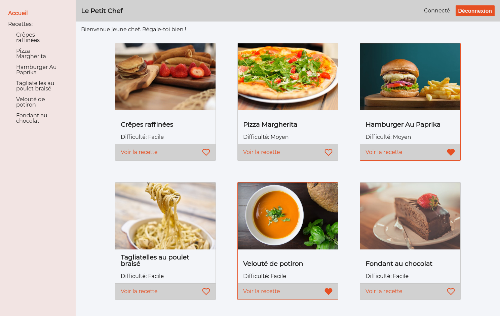

# Le Petit Chef

Site de recettes utilisant React, Redux, React Router. Fetch des datas via Axios.
Tests avec Chai/Enzyme.




## Lancement
Après copie des repos, dans leur dossier respectif:

Front:
```
yarn
yarn start
```
> [Ouvre la page localhost:8080](http://localhost:8080/)

[Back (lien repo)](https://github.com/quentinbrohan/le-petit-chef-back):
```
yarn
yarn start
```

## Connexion

Mail / Password
```
fatman@kebab.food
samurai
```

```
insidejob@gov.com
911
```

```
lignac@gourmand.fr
croquant
```
